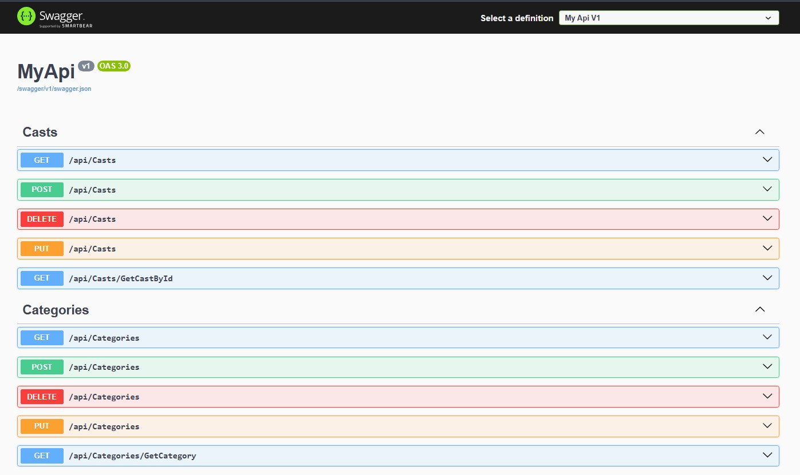
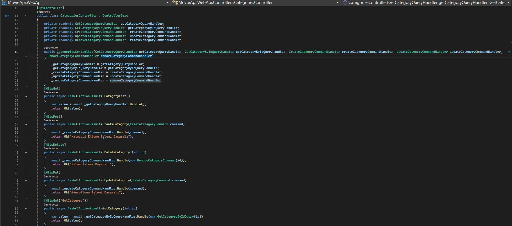
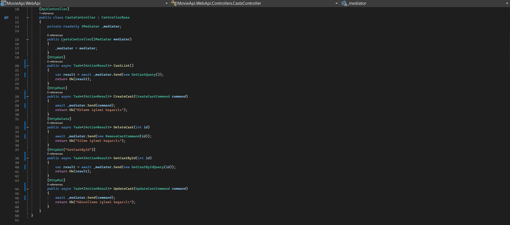
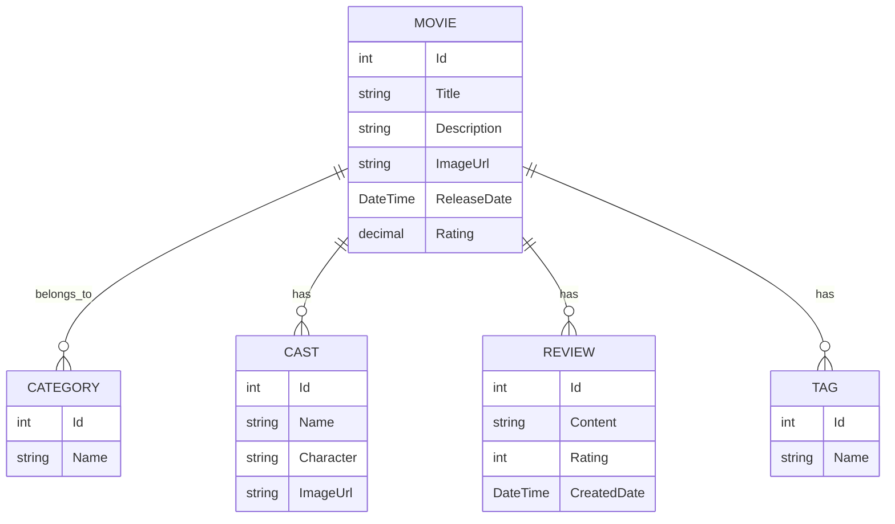

# 🎬 Movie API Projesi

Bu proje, Murat Yücedağ hocamın YouTube kanalında .NET 9.0 ile geliştirdiği ücretsiz bir eğitim projesidir. Proje, film verilerini yönetmek için geliştirilmiş bir Web Projesidir.
22.Derse kadar tamamlanan halidir.

## 🏗️ Mimari Yapı

Proje, Onion Architecture prensiplerine uygun olarak geliştirilmiştir:

```
MovieApi/
├── Core/
│   ├── MovieApi.Domain/          # Entity'ler ve domain modelleri
│   └── MovieApi.Application/     # İş mantığı ve CQRS/MediatR pattern'leri
├── Infrastructure/
│   └── MovieApi.Persistence/     # Veritabanı işlemleri ve context
└── Presentation/
    └── MovieApi.WebApi/         # API katmanı
```

## 🖼️ Arayüz Görüntüleri

### Swagger API Dokümantasyonu
<div align="center">
  
</div>

### CQRS ve MediatR Karşılaştırması
<div align="center">
  
  
</div>

## 🛠️ Kurulum

1. Repoyu klonlayın:
```bash
git clone https://github.com/ismailbarankarasu/MovieApi.git
```

2. Veritabanını oluşturun:
```bash
Update-Database
```

3. API projesini başlatın:
```bash
cd Presentation/MovieApi.WebApi
dotnet run
```

## 🔐 API Endpoints

### Filmler
- `GET /api/Movies` - Tüm filmleri listele
- `GET /api/Movies/{id}` - Belirli bir filmi getir
- `POST /api/Movies` - Yeni film ekle
- `PUT /api/Movies/{id}` - Film güncelle
- `DELETE /api/Movies/{id}` - Film sil

### Kategoriler
- `GET /api/Categories` - Tüm kategorileri listele
- `GET /api/Categories/{id}` - Belirli bir kategoriyi getir
- `POST /api/Categories` - Yeni kategori ekle
- `PUT /api/Categories/{id}` - Kategori güncelle
- `DELETE /api/Categories/{id}` - Kategori sil

### Oyuncular
- `GET /api/Casts` - Tüm oyuncuları listele
- `GET /api/Casts/{id}` - Belirli bir oyuncuyu getir
- `POST /api/Casts` - Yeni oyuncu ekle
- `PUT /api/Casts/{id}` - Oyuncu güncelle
- `DELETE /api/Casts/{id}` - Oyuncu sil

### Etiketler
- `GET /api/Tags` - Tüm etiketleri listele
- `GET /api/Tags/{id}` - Belirli bir etiketi getir
- `POST /api/Tags` - Yeni etiket ekle
- `PUT /api/Tags/{id}` - Etiket güncelle
- `DELETE /api/Tags/{id}` - Etiket sil

## 📊 Veritabanı Şeması



## 🛠️ Kullanılan Teknolojiler

- .NET 9.0
- CQRS (Command Query Responsibility Segregation)
- MediatR
- Entity Framework Core
- Swagger/OpenAPI

## 📚 Dersde Sorulan Sorular

### 1. Task ile void arasındaki fark nedir?
- `void`: Asenkron olmayan, sonucu olmayan işlemler için kullanılır
- `Task`: Asenkron işlemler için kullanılır ve işlemin tamamlanmasını beklemek için kullanılabilir
- `Task<T>`: Asenkron işlemlerden değer döndürmek için kullanılır

### 2. AsNoTracking nedir?
- Entity Framework'te performans optimizasyonu için kullanılır
- Veritabanından çekilen entity'lerin değişiklik takibini yapmaz
- Sadece okuma işlemlerinde kullanılması önerilir
- Memory kullanımını azaltır

### 3. cfg => cfg.RegisterServicesFromAssembly(Assembly.GetExecutingAssembly()) ne işe yarar?
- MediatR'ın servis kayıtlarını otomatik olarak yapmasını sağlar
- Belirtilen assembly'deki tüm handler'ları bulur ve kaydeder
- Manuel servis kaydı yapmaktan kurtarır
- Kod tekrarını önler

## 🤝 Katkıda Bulunma

1. Fork'layın
2. Feature branch oluşturun (`git checkout -b feature/amazing-feature`)
3. Commit'leyin (`git commit -m 'feat: Add amazing feature'`)
4. Push'layın (`git push origin feature/amazing-feature`)
5. Pull Request açın

## 👥 İletişim

- GitHub: [ismailbarankarasu](https://github.com/[ismailbarankarasu])
- LinkedIn: [İsmail Baran KARASU](https://www.linkedin.com/in/ismail-baran-karasu/)
- E-posta: [ismailbaran04@gmail.com](mailto:ismailbaran04@gmail.com)