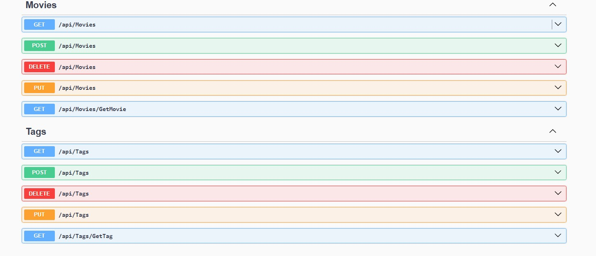

# Movie API Projesi

Bu proje, Murat Yücedağ hocamın YouTube kanalında .NET 9.0 ile geliştirdiği ücretsiz bir eğitim projesidir. Proje, film verilerini yönetmek için geliştirilmiş bir Web Projesidir.
22.Derse kadar tamamlanan halidir.

## Proje Yapısı

Proje, Onion Architecture prensiplerine uygun olarak geliştirilmiştir ve aşağıdaki katmanlardan oluşmaktadır:

- **Core**
  - MovieApi.Domain
    - Entities/
      - Movie.cs
      - Category.cs
      - Cast.cs
      - Review.cs
      - Tag.cs
  - MovieApi.Application
    - Features/
      - CQRSDesignPattern/
      - MediatorDesignPattern/
- **Infrastructure**
  - MovieApi.Persistence
    - Context/
    - Migrations/
- **Presentation**
  - MovieApi.WebApi
    - Controllers/
      - MoviesController.cs
      - CategoriesController.cs
      - CastsController.cs
      - TagsController.cs
    - Program.cs
    - appsettings.json

## API Endpoint'leri

### Movies Controller
- GET /api/Movies - Tüm filmleri listeler
- GET /api/Movies/{id} - Belirli bir filmi getirir
- POST /api/Movies - Yeni film ekler
- PUT /api/Movies/{id} - Film günceller
- DELETE /api/Movies/{id} - Film siler

### Categories Controller
- GET /api/Categories - Tüm kategorileri listeler
- GET /api/Categories/{id} - Belirli bir kategoriyi getirir
- POST /api/Categories - Yeni kategori ekler
- PUT /api/Categories/{id} - Kategori günceller
- DELETE /api/Categories/{id} - Kategori siler

### Casts Controller
- GET /api/Casts - Tüm oyuncuları listeler
- GET /api/Casts/{id} - Belirli bir oyuncuyu getirir
- POST /api/Casts - Yeni oyuncu ekler
- PUT /api/Casts/{id} - Oyuncu günceller
- DELETE /api/Casts/{id} - Oyuncu siler

### Tags Controller
- GET /api/Tags - Tüm etiketleri listeler
- GET /api/Tags/{id} - Belirli bir etiketi getirir
- POST /api/Tags - Yeni etiket ekler
- PUT /api/Tags/{id} - Etiket günceller
- DELETE /api/Tags/{id} - Etiket siler

## Kullanılan Teknolojiler

- .NET 9.0
- CQRS (Command Query Responsibility Segregation)
- MediatR
- Entity Framework Core
- Swagger/OpenAPI

## API Dokümantasyonu

Swagger üzerinden API'yi test edebilir ve dokümantasyonunu inceleyebilirsiniz:

## CQRS ve MediatR Karşılaştırması

Projede hem CQRS hem de MediatR pattern'leri kullanılmıştır. Aşağıdaki görsellerde her iki yaklaşımın controller yapılarını görebilirsiniz:

CQRS yaklaşımında controller'lar daha karmaşık bir yapıya sahiptir çünkü:
- Command ve Query'ler ayrı ayrı yönetilir
- Her işlem için ayrı handler'lar oluşturulur
- Daha fazla kod tekrarı olabilir

MediatR kullanımında ise:
- Kod daha temiz ve anlaşılır
- Handler'lar merkezi olarak yönetilir
- Daha az kod tekrarı
- Daha kolay test edilebilirlik

## Dersde sorulan sorular

### 1. Task ile void arasındaki fark nedir?
- `void`: Asenkron olmayan, sonucu olmayan işlemler için kullanılır
- `Task`: Asenkron işlemler için kullanılır ve işlemin tamamlanmasını beklemek için kullanılabilir
- `Task<T>`: Asenkron işlemlerden değer döndürmek için kullanılır

### 2. AsNoTracking nedir?
- Entity Framework'te performans optimizasyonu için kullanılır
- Veritabanından çekilen entity'lerin değişiklik takibini yapmaz
- Sadece okuma işlemlerinde kullanılması önerilir
- Memory kullanımını azaltır

### 3. cfg => cfg.RegisterServicesFromAssembly(Assembly.GetExecutingAssembly()) ne işe yarar?
- MediatR'ın servis kayıtlarını otomatik olarak yapmasını sağlar
- Belirtilen assembly'deki tüm handler'ları bulur ve kaydeder
- Manuel servis kaydı yapmaktan kurtarır
- Kod tekrarını önler